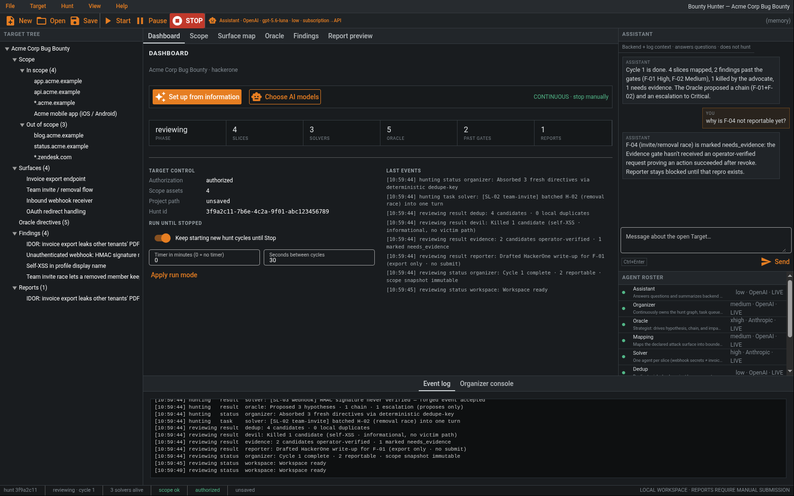
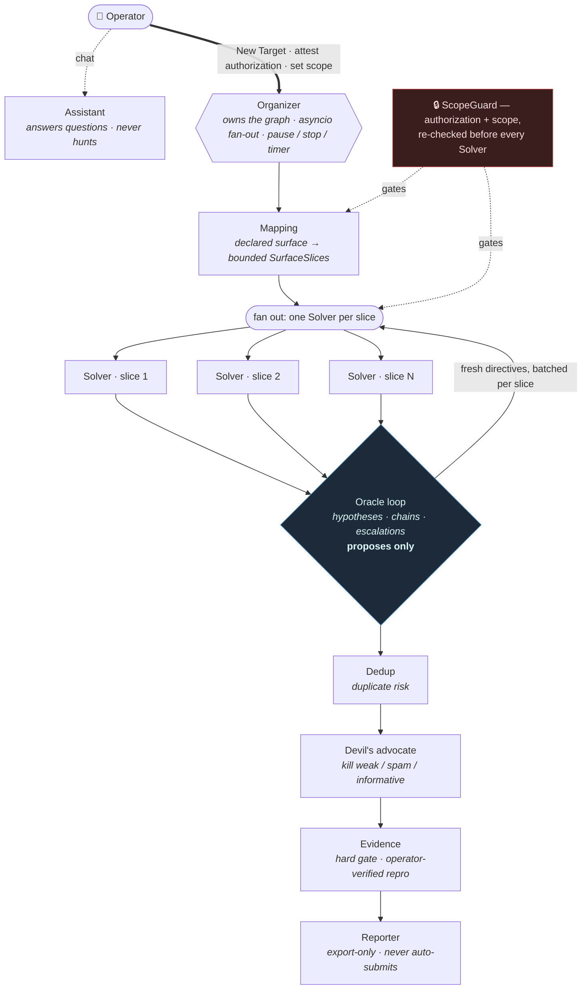

# Bounty Hunter

**A Linux desktop-style workspace that orchestrates a team of specialized AI agents for _authorized_ bug bounty work.**

[](https://github.com/hax1ng/bounty-hunter/actions/workflows/ci.yml)
[](https://www.python.org/downloads/)
[](LICENSE)
[](https://github.com/astral-sh/ruff)
[](#models--providers)

Bounty Hunter is a single-user workbench modeled on tools you already know — the project + tooling layout of Burp Suite, the New / Open / Save database model of Binary Ninja. You define a **Target** (scope, platform, authorization), assign a provider, model, and reasoning level per role, and then a graph of nine specialized agents maps the attack surface, runs one Solver per slice, escalates through an Oracle strategist loop, and drafts a platform report — all behind hard authorization, scope, and evidence gates.

<p align="center">
  
  <br>
  <sub>The workspace after one hunt cycle on a <b>synthetic demo</b> Target — populated target tree, dashboard, multi-provider agent roster, Oracle directives, findings across every gate, and a live event log streaming the agents' work. <b>No real assets were tested.</b></sub>
</p>

> [!WARNING]
> **This is not a scanner you point at random hosts.** Authorization is required to create a Target, every Solver is re-checked against scope before it runs, and the Reporter **never auto-submits**. Use it only on programs and assets you are explicitly permitted to test. See [`docs/SAFETY.md`](docs/SAFETY.md).

---

## Contents

- [The multiagent workflow](#the-multiagent-workflow) — the showcase
- [Quickstart](#quickstart) — install & run
- [Using the workspace](#using-the-workspace)
- [Models & providers](#models--providers)
- [A Target on disk](#a-target-on-disk)
- [Project layout](#project-layout)
- [Development](#development)
- [Documentation](#documentation)

---

## The multiagent workflow

Nine fixed roles, one orchestrator. The **Organizer** owns the hunt graph and fans work out with `asyncio`; every other agent has a narrow, testable job. The design principle throughout: **cut the surface small, give each Solver exactly one slice, and let deterministic gates — not a model — decide what becomes a report.**



### The roster

| Role | Hunts? | Job |
| --- | :---: | --- |
| **Assistant** | no | Answers the operator and reads a bounded read-only backend snapshot + recent logs. Never maps, exploits, or writes reports. |
| **Organizer** | orchestrates | Owns the hunt graph, task queue, pause/stop/timer controls, and `asyncio` fan-out. Pure mechanism. |
| **Oracle** | proposes | Strategist. Emits typed hypotheses, cross-finding chains, and impact escalations. **Proposes only — Solvers execute.** |
| **Mapping** | yes | Turns declared in/out-of-scope surface into bounded **SurfaceSlices**. |
| **Solver** | yes | **One agent per slice.** A payment-export IDOR and a Slack webhook leak are different bugs — they don't share context. |
| **Dedup** | yes | Duplicate risk against other local candidates. |
| **Devil's advocate** | yes | Kills informative / spam / weak reports before they waste a slot. |
| **Evidence** | yes | Extracts operator-verified reproduction steps and artifact paths. Missing evidence blocks reporting. |
| **Reporter** | writes only | Platform-specific write-up (HackerOne, Bugcrowd, …). **Never auto-submits.** |

### Why one Solver per slice

A single "hunt the whole program" agent smears context and produces mush. Mapping cuts the declared surface into bounded slices so each Solver stays inside exactly one — different bug, different impact, different evidence. The same invariant holds inside the Oracle loop: hypotheses for **different** slices run concurrently, while multiple hypotheses for the **same** slice are batched into that slice's single Solver turn.

### The Oracle strategist loop

After the baseline Solver sweep, the Organizer runs the Oracle as a **bounded loop**:

1. The Oracle reads the surface map + findings so far and emits typed directives — falsifiable `Hypothesis` records, `Chain` proposals across findings, and `Escalation` proposals on a single finding.
2. The Organizer derives a deterministic `dedupe_key` for each and absorbs **only the fresh ones**, then groups hypotheses by slice.
3. It starts **one focused Solver turn per slice**; other slices fan out in parallel. `ScopeGuard.require_slice` fires before every Solver, so the propose/schedule split never widens scope.
4. A confirmed hypothesis becomes a Finding tagged with its `hypothesis_id`.
5. The loop stops when the Oracle reports `converged`, after two dry rounds, or at a fixed round cap.

The pure keying/absorption logic lives in [`organizer/oracle.py`](src/bountyhunter/organizer/oracle.py) and is unit-tested independently of the loop.

### The promotion pipeline is strict

Findings don't become reports by vibes. Every candidate must survive **Dedup → Devil's advocate → Evidence → Reporter**. Evidence is a **hard gate**: a candidate stays `needs_evidence` until it contains operator-supplied reproduction steps, and screenshot/video/request-response paths are accepted only when they already appear in operator material. Stub/demonstration candidates are always killed by the advocate and can never become reports.

---

## Quickstart

Requires **Python 3.11+**. [`uv`](https://docs.astral.sh/uv/) is recommended but plain `pip` works too.

```bash
git clone https://github.com/hax1ng/bounty-hunter.git
cd bounty-hunter

# with uv (recommended)
uv venv --python 3.11
source .venv/bin/activate
uv pip install -e ".[dev]"

# ...or with pip
python3.11 -m venv .venv
source .venv/bin/activate
pip install -e ".[dev]"

# launch the workspace
bountyhunter
```

This opens the workspace at **`http://127.0.0.1:8088`** (localhost only — it does **not** bind to your LAN).

```bash
bountyhunter --native     # native desktop window (needs the `native` extra: pip install -e ".[native]")
bountyhunter version      # print version and exit
```

Bounty Hunter starts in **local-stub mode** — no hosted model calls, no network, safe to explore. Hosted AI is opt-in per role; see [Models & providers](#models--providers).

---

## Using the workspace

Dense dark chrome, not a marketing page. Inspiration, not a clone: Burp Suite's project + tool layout, Binary Ninja's New / Open / Save.

| Region | What it is |
| --- | --- |
| **File / Target / Hunt / View / Help** | New Target, Open, Recent, Save, Save As, Close, Quit; provider connections; Start / Pause / Stop |
| **Left tree** | Scope assets, SurfaceSlices, findings, reports |
| **Center tabs** | Dashboard (guided setup + model controls), Scope, Surface map, Slice/Finding inspectors, Report preview |
| **Right** | Assistant chat (reads backend/log context; does not hunt) and the agent roster |
| **Bottom** | Streaming event log / Organizer console |
| **Status bar** | Hunt id, phase/current cycle, live Solvers, scope and authorization gates |

Unsaved work shows a `*` in the title; New / Open / Close / Quit prompt if the Target is dirty.

### A typical hunt

1. **Set up with AI** (paste a program's scope table / policy text and get a typed, reviewable draft) — or **File → New Target…** (`Ctrl+N`) for manual setup. Review scope and **attest authorization**.
2. On **Scope**, add operator-verified observations, reproduction steps, and any screenshot/video/request-response paths.
3. **File → Save** (`Ctrl+S`) or **Save Target As…** to choose the Target folder.
4. **Hunt → Start** schedules the graph: Mapping → one Solver per slice → the Oracle loop → Dedup → Devil's advocate → Evidence → Reporter.
5. Review findings and the **export-only** report preview. You submit it yourself, on the platform.

Guided setup extracts a draft from pasted text only — it has no browse/hunt tools and **cannot grant authorization**. The operator reviews the draft and attests separately.

---

## Models & providers

Each role picks a **provider** (OpenAI or Anthropic), a model, and a reasoning level. Live roles try the provider's existing **subscription login first**, then optionally fall back to that provider's metered API through [pydantic-ai](https://ai.pydantic.dev/).

| Provider | Subscription route | API fallback | Reasoning knob |
| --- | --- | --- | --- |
| **OpenAI** | `codex login` (ChatGPT) → Codex app-server | `OPENAI_API_KEY` | reasoning effort |
| **Anthropic** | `claude auth login` (Claude Pro/Max) → `claude` CLI | `ANTHROPIC_API_KEY` | `--effort` / extended thinking |

Reasoning levels are provider-neutral: `none · low · medium · high · xhigh · max`. Pick models from **Dashboard → Choose AI models**, the toolbar model chip, or **Scope → Model policy per role** — apply to one role or every role, and type any model id you like.

Subscription turns are **ephemeral and output-only**: the Anthropic route runs `claude --print` with **all tools disabled** (`--tools ""`), no MCP, no session persistence, and a `--json-schema` structured output inside an empty temp directory; the OpenAI route runs a tool-free Codex app-server thread with an empty read-only sandbox. Neither route exposes recon, network, or submission tools. API keys are **never** written to the Target, settings, event log, or prompts.

See Anthropic's [Claude Code headless/print mode](https://docs.claude.com/en/docs/claude-code/sdk) and [model overview](https://docs.claude.com/en/docs/about-claude/models/overview), and OpenAI's [Codex auth](https://learn.chatgpt.com/docs/auth) and [model catalog](https://developers.openai.com/api/docs/models). Full detail lives in [`docs/AGENTS.md`](docs/AGENTS.md).

---

## A Target on disk

A **Target** is the project — the New / Open / Save unit, like a Burp project file or a Binary Ninja database.

```
my-target.bountyhunt/
  target.json         # canonical typed Target manifest
  .bountyhunt.json    # compatible direct-open manifest
  events.jsonl        # append-only HuntEvents
  scope.md            # human-readable in/out-of-scope dump
  notes.md
  slices/             # serialized SurfaceSlices
  findings/
  evidence/           # screenshot / video paths
  reports/            # exported write-ups; never auto-submitted
```

Default location: `~/bountyhunter/targets/<slug>.bountyhunt/`. Open the folder, `target.json`, or `.bountyhunt.json` directly. App settings (recent targets) live in `~/.config/bountyhunter/settings.json`.

---

## Project layout

```
src/bountyhunter/
  cli.py            # typer entry point (bountyhunter)
  models.py         # pydantic Target / SurfaceSlice / Finding / HuntEvent
  session.py        # in-memory Target + dirty fingerprint
  store.py          # HuntStore: folder, artifacts, events.jsonl
  events.py         # typed EventBus
  safety.py         # ScopeGuard: authorization + scope gates
  providers.py      # subscription / API provider plumbing
  settings.py       # app settings + recent targets
  agents/           # the roster: factory, live routing, per-provider subscription adapters, reporter, reasoning
  organizer/        # Organizer service + Oracle keying/absorption loop
  gui/              # NiceGUI workspace: app, pages, workspace, dialogs, theme
tests/              # 78 tests: models, store, session, agents, oracle, providers, cli, gui
docs/               # ARCHITECTURE · AGENTS · SAFETY · ROADMAP
```

**Stack:** Python 3.11+, pydantic v2, pydantic-ai (OpenAI + Anthropic), asyncio, NiceGUI, typer.

---

## Development

```bash
uv pip install -e ".[dev]"

pytest -q           # run the suite (78 tests)
ruff check .        # lint
ruff format .       # format
```

CI runs ruff + pytest on Python 3.11 and 3.12 for every push and PR (see [`.github/workflows/ci.yml`](.github/workflows/ci.yml)). Contributions are welcome — please read [`CONTRIBUTING.md`](CONTRIBUTING.md) and, especially, [`docs/SAFETY.md`](docs/SAFETY.md) first.

---

## Documentation

- [Architecture](docs/ARCHITECTURE.md) — process model, data path, dirty tracking
- [Agents](docs/AGENTS.md) — the roster, the Oracle loop, defaults, provider routing
- [Safety](docs/SAFETY.md) — the hard rules and what will never be added
- [Roadmap](docs/ROADMAP.md) — what's built vs. next
- [Changelog](CHANGELOG.md)

---

## License

[MIT](LICENSE) © 2026 hax1ng
